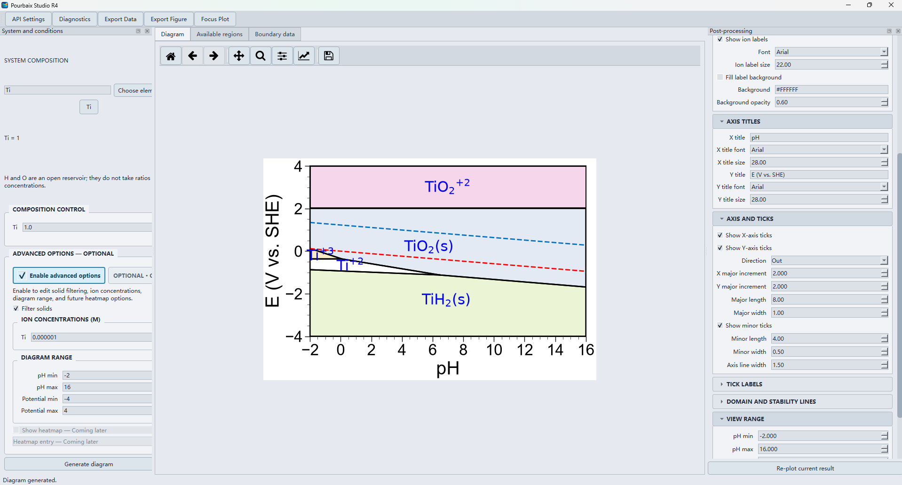

# Pourbaix Studio R4

[English](README.md) | [简体中文](README.zh-CN.md)

Pourbaix Studio R4 is a Windows desktop workbench for querying Materials Project data and creating publication-ready pH–potential stability diagrams through pymatgen.

Official repository: <https://github.com/ZiYingZhang/Pourbaix-Diagram-from-Materials-Project>



## Download and run

1. Open the repository [Releases](https://github.com/ZiYingZhang/Pourbaix-Diagram-from-Materials-Project/releases) page and download `PourbaixStudioR4-win64.zip`.
2. Extract the ZIP completely. Do not run the application from inside the archive.
3. Keep `PourbaixStudioR4.exe` beside its `_internal` directory and launch the EXE.
4. Open **API Settings**, obtain a key from the [Materials Project API page](https://next-gen.materialsproject.org/api), paste it into the masked field, and choose **Use for this session** or **Remember and use**.
5. Define the system, composition, concentrations, pH range, and potential range; then select **Generate diagram**.

The portable package does not require a separate Python installation or administrator rights. See the [English user guide](USER_GUIDE.md) or [中文使用教程](USER_GUIDE.zh-CN.md) for the complete workflow.

## Run from source

The verified development target is Windows x64 with CPython 3.13. From the project folder:

```powershell
python -m venv .venv-pourbaix-py313
.\.venv-pourbaix-py313\Scripts\python.exe -m pip install --no-cache-dir -r requirements-lock-py313-win64-r4.txt
.\.venv-pourbaix-py313\Scripts\python.exe pourbaix_studio_R4.py --self-test
.\.venv-pourbaix-py313\Scripts\python.exe pourbaix_studio_R4.py
```

VS Code uses `${workspaceFolder}`-relative settings. The source folder may therefore be renamed or moved. Recreate `.venv-pourbaix-py313` after moving the project instead of relying on a relocated virtual environment.

## Main features

- Up to four closed elements with freely editable composition ratios
- Periodic-table element selection or direct formula entry
- H and O handled as open reservoirs, without ratios or ion concentrations
- Materials Project API access with optional secure storage in Windows Credential Manager
- Composition, ion-concentration, solid-filter, pH, and potential controls
- Correct clipped equilibrium-domain polygons and selectable region fills
- Re-plotting from the current result without another API request
- Publication controls for labels, fonts, axis titles, major-tick increments, lines, view range, physical page size, DPI, and transparency
- Figure export to PNG, SVG, and TIFF; boundary export to CSV, XLSX, and TXT
- Scrollable sidebars, periodic-table selection, compact-screen layout, and Focus Plot mode

## API key

Obtain a key from <https://next-gen.materialsproject.org/api>. R4 can remember it in Windows Credential Manager. It does not save new keys to project files or include keys in release archives. For compatibility only, an existing `mp_api_key.txt` beside the source launcher or packaged executable can still be read.


## Build the portable Windows package

The release is a PyInstaller `onedir` package. Build it from the project folder:

```powershell
powershell.exe -NoProfile -ExecutionPolicy Bypass -File .\scripts\build_release_r4.ps1
```

The script uses the project-local virtual environment by default. A different verified interpreter can be supplied with `-PythonPath`. It runs the complete test suite, source smoke tests, the PyInstaller build, packaged smoke tests, ZIP extraction, and smoke tests from the extracted package. It also rejects API-key and log files and writes a release manifest containing versions, test count, archive size, SHA-256, and external-acceptance status.

Outputs are written to `_release\R4.0`:

- `PourbaixStudioR4\` — portable application directory
- `PourbaixStudioR4-win64.zip` — distributable archive
- `release-manifest.json` — reproducibility and verification record

Keep `PourbaixStudioR4.exe` beside its `_internal` directory. The whole `PourbaixStudioR4` folder may be moved to another location.

Clean-machine verification on a separate Windows x64 computer without Python remains an external acceptance step for each final archive hash.

Published Windows packages will be available from the repository's [Releases page](https://github.com/ZiYingZhang/Pourbaix-Diagram-from-Materials-Project/releases).

## Scientific contract

pH is dimensionless and potential is volts versus SHE. Diagram construction is delegated to the dependency versions recorded in `requirements-lock-py313-win64-r4.txt`. Display settings never change calculated boundary coordinates, and a failed calculation cannot leave stale data exportable under new inputs.

## Documentation

- [Windows quick start](USER_GUIDE.md)
- [中文使用教程](USER_GUIDE.zh-CN.md)
- [中文项目说明](README.zh-CN.md)
- [中文 VS Code 运行教程](VS_CODE运行教程.md)
- [R4 design](docs/superpowers/specs/2026-08-22-pourbaix-r4-pyside6-design.md)
- [Scientific contract](docs/numerical-contract.md)
- [Acceptance checklist](docs/acceptance-checklist.md)

## Acknowledgements

Pourbaix Studio uses data and services from the [Materials Project](https://materialsproject.org/) and scientific functionality from [pymatgen](https://pymatgen.org/). Please follow the citation guidance of these projects when using generated results in publications.
